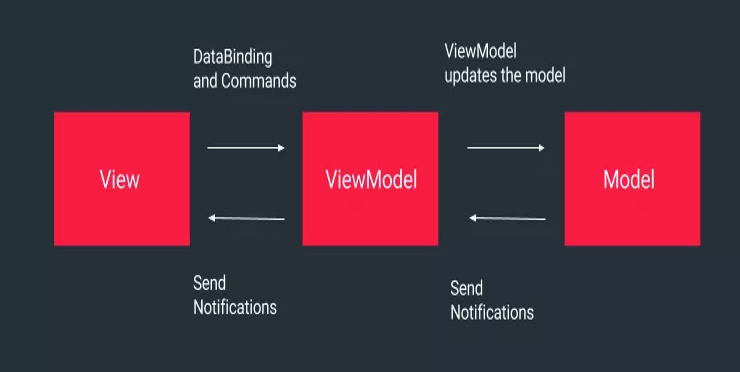
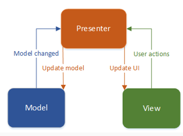

# MVP and MVVM Pattern

## MVVM (Model View ViewModel)
MVVM facilitates a separation of development of the graphical user interface – be it via a markup language or GUI code – from development of the business logic or back-end logic (the data model). The view model of MVVM is a value converter

## MVP
MVP is a user interface architectural pattern engineered to facilitate automated unit testing and improve the separation of concerns in presentation logic:

+ The model is an interface defining the data to be displayed or otherwise acted upon in the user interface.
+ The presenter acts upon the model and the view. It retrieves data from repositories (the model), and formats it for display in the view.
+ The view is a passive interface that displays data (the model) and routes user commands (events) to the presenter to act upon that data.

